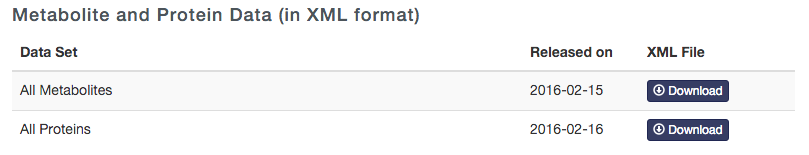

This script updates the Human Metabolites Database (HMDB) files for OpenMS

It generates a HMDBMappingFile.tsv and a HMDB2StructMapping.tsv that is used by the AccurateMassSearch tool

Steps to do:
============
 
1. `git clone` this repo
2. Download "**All Metabolites**" files as XML from http://www.hmdb.ca/downloads   

3. extract into any folder, e.g, default: /your/path/hmdb_metabolites
4. delete hmdb_metabolites.xml unless it is the only file
5. execute python script:
```
python generateHMDBFilesForOpenMS.py /your/path/hmdb_metabolites/
```
6. double-check
7. create a pull request to the OpenMS/OpenMS repository

Requires:
=========

- python 3.6+
- lxml
